# golfbot
[](https://www.youtube.com/watch?v=Ou8qCmr9eWY&list=PLX4MtaacavIiuLv5J_uSyMYdoqZit-67E&index=2)
# GolfBot - AI 기반 골프 캐디 로봇

## 📌 프로젝트 개요
**GolfBot**은 AI 및 자율주행 기술을 활용하여 골프장에서 플레이어를 보조하는 스마트 캐디 로봇입니다. YOLO 기반의 객체 추적 및 LegTracker를 활용하여 플레이어를 자동으로 따라가며, 분석을 위한 가장 적합한 위치로 이동하여 사용자의 골프 스윙을 분석하여 피드백을 제공합니다.

## 🚀 주요 기능
### 🔹 **AI 기반 플레이어 Tracking**
- **카메라**: YOLO를 이용한 플레이어 객체 탐지 및 추적
- **LiDAR**: LegTracker 기반의 다리 추적을 통한 트랙킹

### 🔹 **스마트 정지 & 최적 촬영 위치 이동**
- **정면 인식 후 정지**: Haarcascade face frontal 모델 사용 (프레임 70% 이상 얼굴 감지 시 정지)
- **Mediapipe 마커 데이터 활용**: 카메라 각도 및 촬영 높이 자동 조절

### 🔹 **자세 분석 및 피드백 제공**
- 촬영 후 **자세 평가** 기능 제공
- ChatGPT API를 활용한 'Quantitative Golf Swing Analysis based on Kinematic Mining Approach' 논문 기반 피드백 제공 

## 시스템 아키텍처
- 시스템 아키텍처
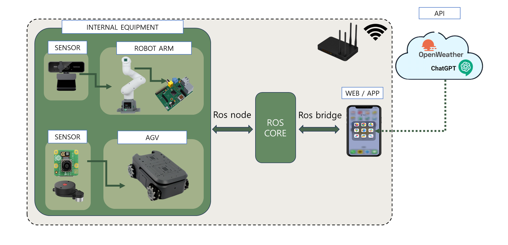

- 다이어그램
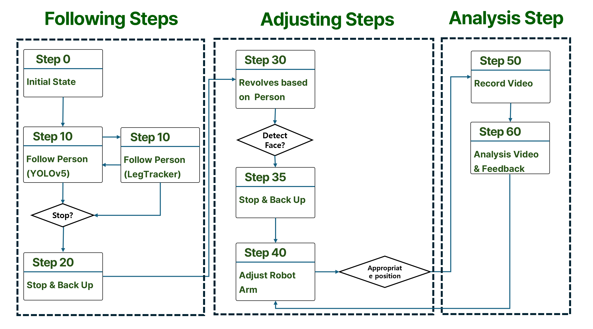

## 상세 설명
### 트랙킹
| YOLOv5 | LegTracker |
|--------|------------|
| 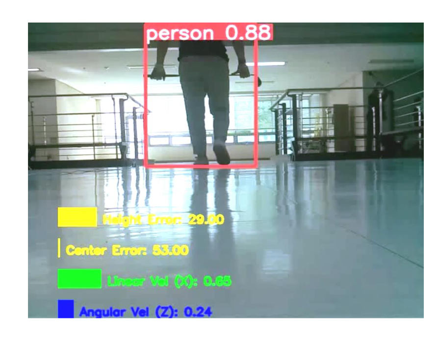 | 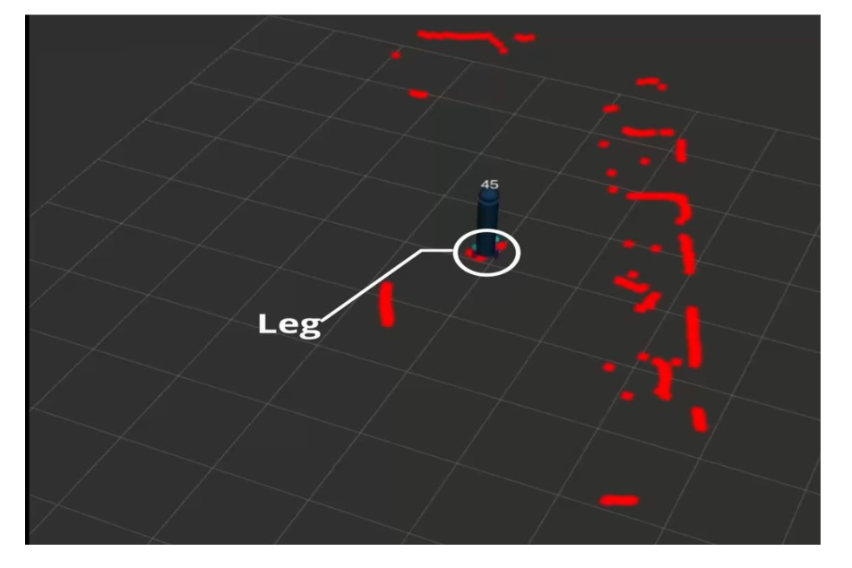 |


#### YOLOv5를 이용한 트랙킹

| 상관관계 분석 | 경향성 분석 |
|--------------|------------|
| 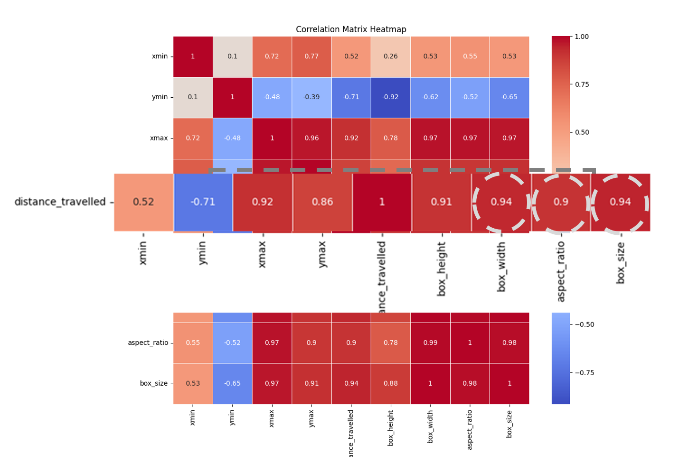 | 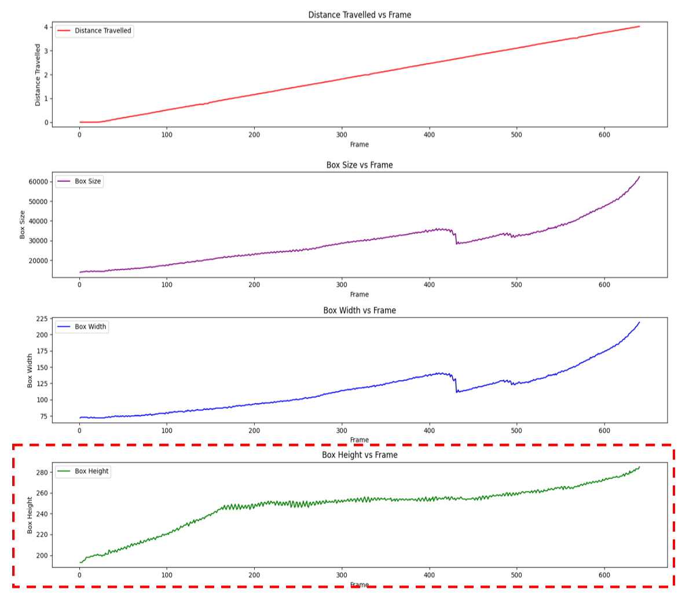 |


- 상관관계 분석 결과 : Box Size, Width, Height가 가장 안정적, 가로길이 영향을 받지 않는 Height 선택
- 경향성 분석 : Height의 경우 특정 위치(Box의 Height가 전체화면과 같거나 클 때) 이전 까지 1차식 형태를 나타냄. 이에 적정 유지거리 (0.5m)에 따른 제어 적용

#### LegTracker를 이용한 트랙킹
- 카메라에 이상 발생 시 LegTracker(2D LiDAR 기반)로 제어권 이전
- AGV와 Human Leg의 거리 기반 제어

#### PID
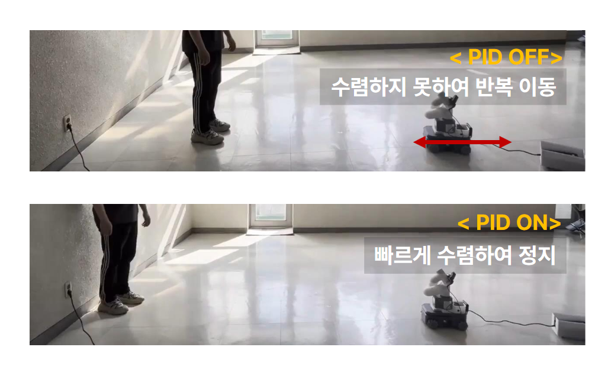
- 위치 수렴 시 오실리에이션 문제를 방지하기 위해 적용
- Threshold 추가를 통한 빠른 수렴

### 분석을 위한 최적위치 이동
#### 정면으로 이동
| 정면이동 TOP | 정면이동 Front |
|--------------|------------|
| 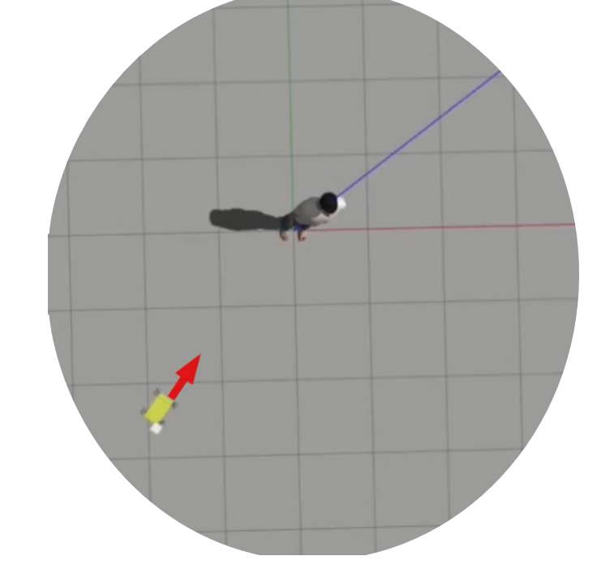 | 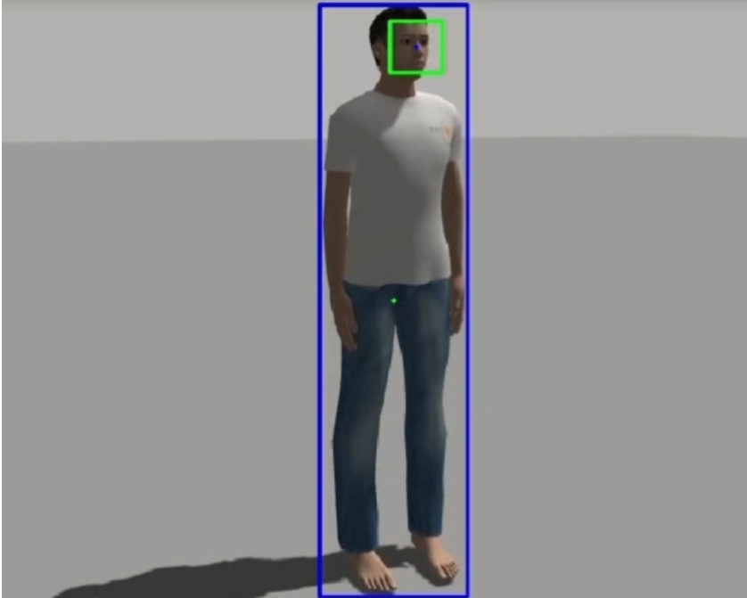 |
- 사용자를 트랙킹 하기에 사용자의 뒤에서 사용자의 정면으로의 이동 필요
- OmniWheel의 특성을 활용하여 사용자를 중심으로 원회전
- 사용자의 정면 인지 시 (10프레임 중 4프레임) 정지 (Haarcascade FrontalFace Alt2 모델 사용)

#### 최적위치 이동
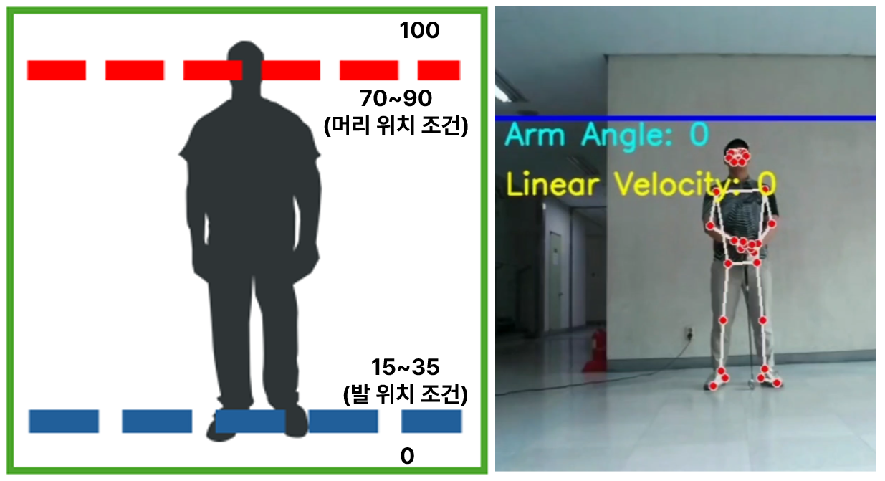 
- 논문 기준 골프 자세 분석에서 가장 많이 사용 되는 위치 조건 선정
- 해당 조건을 맞추기 위하여 AGV와 로봇암 조정 

### 분석
#### 피드백
| 피드백 아케텍처 | 피드백 |
|--------------|------------|
| 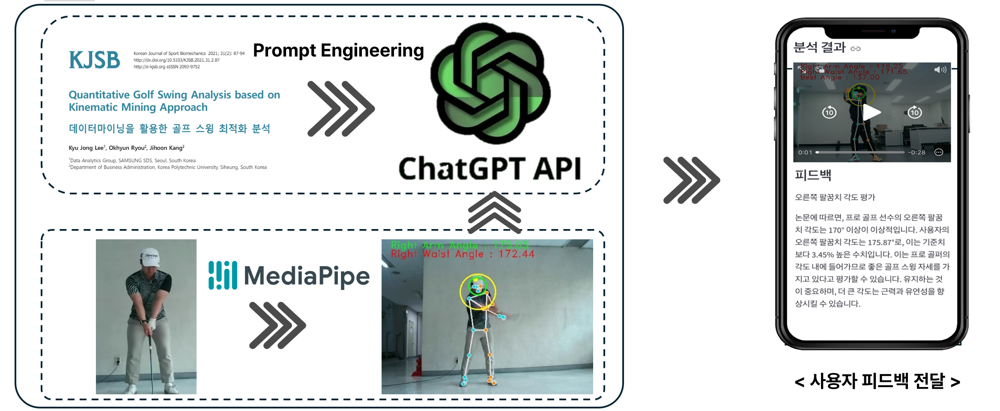 | 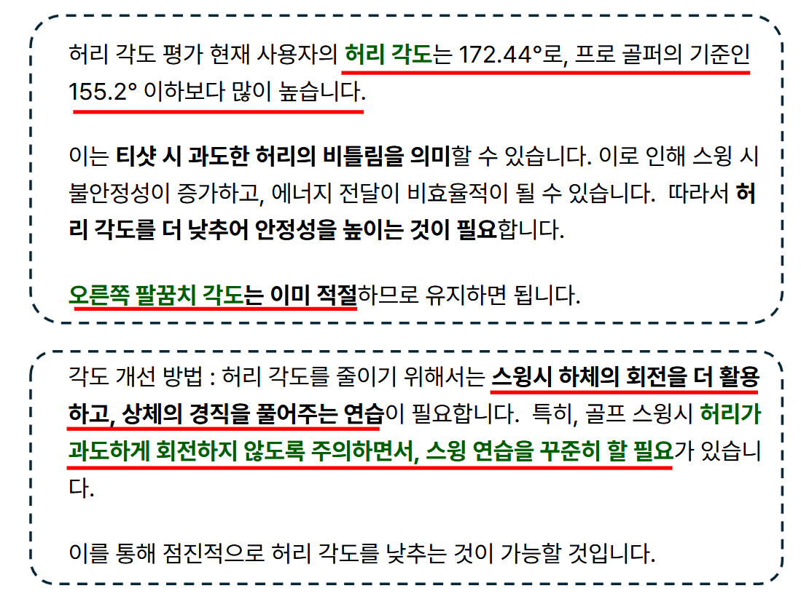 |
- _Quantitative Golf Swing Analysis based on Kinematic Mining Approach_ 논문 참조
- Mediapipe를 이용한 허리각도, 오른쪽 팔꿈치 각도 추출
- 해당 각도와 GPT API를 기반으로 사용자 피드백 제공 

## 🛠 기술 스택
| 기술 | 설명 |
|------|------|
| **YOLO** | 플레이어 객체 감지 및 추적 |
| **LegTracker** | LiDAR 기반 다리 추적 |
| **ROS2** | 로봇 운영 시스템 |
| **Mediapipe** | 자세 분석 및 카메라 제어 |

## 📌 실행 방법

- yolov5 파일만 다운 후 압축해제해서 사용해주세요.

```bash
# ROS2 환경 설정
source /opt/ros/humble/setup.bash

# 패키지 빌드 및 실행

## Build
```bash
git clone https://github.com/lollolha97/kairos_golfbot.git
cd kairos_golfbot
catkin_make
```

## launch
```bash
roslaunch myagv_controller golf_bot.launch
python ./streamlit/gui.py
```

## 📚 참고 자료
- YOLO v5 ROS : https://github.com/mats-robotics/yolov5_ros
- LegTracker : https://github.com/angusleigh/leg_tracker
- GolfDB: A Video Database for Golf Swing Sequencing
- Quantitative Golf Swing Analysis based on Kinematic Mining Approach 

